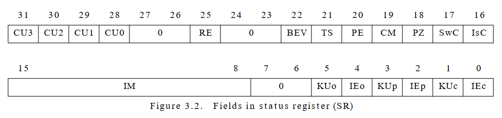

# 

[](https://crates.io/crates/regent)
[](https://docs.rs/regent)
[](./LICENSE)

*Regent* is a Rust crate for making bitfield structures. The sole API is the attribute macro `#[bitwise]`, which generates a struct of tightly packed, arbitrarily wide fields with accompanying constructors and accessor methods.

To get started, add the *regent* crate from [crates.io](https://crates.io) to your `Cargo.toml`:

```toml
[dependencies]
regent = "0.2"
```

Then, head over to the crate documentation at [docs.rs] to learn how to use Regent.

[docs.rs]: https://docs.rs/regent/latest/regent

## Example

<details>
<summary>A code sample demonstrating Regent.</summary>
<br>

The struct definition

```rust
#[regent::bitwise(width = 32)]
pub struct Frobnicator {
    pub foo: u8,
    pub bar: u5,
    #[constant = 1234]
    pub baz: u11,
    pub qux: (bool, u4),
    pub quux: [u1; 3],
}
```

roughly expands to the following. (Function bodies are omitted for brevity.)

```rust
#[repr(transparent)]
pub struct Frobnicator(u32);

impl Frobnicator {
    pub fn new(foo: u8, bar: u8, qux: (bool, u8), quux: [u8; 3]) -> Self {/* ... */}

    pub fn foo(&self) -> u8 {/* ... */}
    pub fn bar(&self) -> u8 {/* ... */}
    pub const fn baz() -> u16 { 1234 }
    pub fn qux(&self) -> (bool, u8) {/* ... */}
    pub fn quux(&self) -> [u8; 3] {/* ... */}

    pub fn set_foo(&mut self, field: u8) {/* ... */}
    pub fn set_bar(&mut self, field: u8) {/* ... */}
    pub fn set_qux(&mut self, field: (bool, u8)) {/* ... */}
    pub fn set_quux(&mut self, field: [u8; 3]) {/* ... */}
}

impl regent::Bitwise for Frobnicator {
    const WIDTH: usize = 32;
    type Repr = u32;

    unsafe fn from_repr_unchecked(repr: Self::Repr) -> Self {/* ... */}
    fn from_repr_checked(repr: Self::Repr) -> Option<Self> {/* ... */}
    fn to_repr(&self) -> Self::Repr {/* ... */}
    fn into_repr(self) -> Self::Repr {/* ... */}
}

impl regent::BitwiseExt for Frobnicator {
    const REPR_WIDTH: usize = 32;
}
```

</details>

## Motivation

### What is Rust?

Rust is a new systems programming language with an emphasis on performance and correctness. Rust is primarily imperative with functional influences such as closures, traits, and iterators. Rust also has rich meta-programming capabilities, offering two flavors of macros: declarative macros, which are built into the language, and procedural macros, which are standalone Rust libraries that manipulate the AST directly.

### What are Bitfields?

For all of the things Rust has, *bitfields* it has not. Roughly speaking, a bitfield is a struct field whose width is measured in bits rather than bytes. Structs comprised of bitfields are tightly packed, making them convenient for representing dense structures like CPU registers and network packets. Without bitfields, these structures are usually represented with integers and manipulated through handcrafted bitwise operations, which are tedious to write and difficult to debug.

<details>
<summary>Motivating Example</summary>
<br>



> (Source: [*IDT R30xx Family Software Reference Manual*](https://cgi.cse.unsw.edu.au/~cs3231/doc/R3000.pdf), published in 1994 by Integrated Device Technology, Inc.)

Take the status register from a MIPS CPU, for example. Imagine modeling this structure in your favorite programming language without using bitfields. A register field might look something like this:

```c
// Extracts the IM field from the status register.
unsigned SrGetIm(const unsigned sr) {
    return (sr >> 8) & ((1 << 8) - 1);
}

// Sets the IM field in the status register to the given value.
void SrSetIm(unsigned *sr, const unsigned im) {
    const unsigned mask = (1 << 8) - 1;
    // Clear the previous value.
    *sr &= ~(mask << 8);
    // Write the new value.
    *sr |= (im & mask) << 8;
}
```

There is a lot of repetition here. The expression <code>(1&nbsp;<<&nbsp;<em>width</em>)&nbsp;-&nbsp;1</code> keeps showing up, as does the *`offset`* in <code>sr&nbsp;>>&nbsp;<em>offset</em></code>, <code>mask&nbsp;<<&nbsp;<em>offset</em></code>, and <code>(<em>field</em>&nbsp;&&nbsp;mask)&nbsp;<<&nbsp;<em>offset</em></code>. We can introduce some constants and a helper function:

```c
static const unsigned IM_WIDTH = 8;
static const unsigned IM_OFFSET = 8;

static unsigned Mask(const unsigned width) {
    // Note: this is UB when `width` is greater than or equal to the bit-width
    // of the `int` type.
    return (1 << width) - 1;
}

unsigned SrGetIm(const unsigned sr) {
    return (sr >> IM_OFFSET) & Mask(IM_WIDTH);
}

void SrSetIm(unsigned *sr, const unsigned im) {
    const unsigned mask = Mask(IM_WIDTH);
    *sr &= ~(mask << IM_OFFSET);
    *sr |= (im & mask) << IM_OFFSET;
}
```

And now that the getter and setter functions are generic, you might even introduce a macro:

```c
static unsigned Mask(const unsigned width) {
    return (1 << width) - 1;
}

#define FIELD(NAME, WIDTH, OFFSET) \
    unsigned SrGet ## #NAME(const unsigned sr) { \
        return (sr >> OFFSET) & Mask(WIDTH); \
    } \
    void SrSet ## #NAME(unsigned *sr, const unsigned value) { \
        const unsigned mask = Mask(WIDTH); \
        *sr &= ~(mask << OFFSET); \
        *sr |= (value & mask) << OFFSET; \
    }

FIELD(Iec, 1, 0)
FIELD(Kuc, 1, 1)
FIELD(Iep, 1, 2)
FIELD(Kup, 1, 3)
FIELD(Ieo, 1, 4)
FIELD(Kuo, 1, 5)
FIELD(Im, 8, 8)
FIELD(Isc, 1, 16)
FIELD(Swc, 1, 17)
FIELD(Pz, 1, 18)
FIELD(Cm, 1, 19)
FIELD(Pe, 1, 20)
FIELD(Ts, 1, 21)
FIELD(Bev, 1, 22)
FIELD(Re, 1, 25)
FIELD(Cu0, 1, 28)
FIELD(Cu1, 1, 29)
FIELD(Cu2, 1, 30)
FIELD(Cu3, 1, 31)
```

We are quickly approaching a *declarative* solution.

Now, imagine modeling the same structure with bitfields. Here's what it could look like:

```c
struct Sr {
    bool cu3: 1;
    bool cu2: 1;
    bool cu1: 1;
    bool cu0: 1;
    unsigned _26: 2;
    bool re: 1;
    unsigned _23: 2;
    bool bev: 1;
    bool ts: 1;
    bool pe: 1;
    bool cm: 1;
    bool pz: 1;
    bool swc: 1;
    bool isc: 1;
    unsigned im: 8;
    unsigned _6: 2;
    bool kuo: 1;
    bool ieo: 1;
    bool kup: 1;
    bool iep: 1;
    bool kuc: 1;
    bool iec: 1;
};
```

</details>

The bitfield as a language construct was in part popularized by its inclusion in the C programming language. Bitfields offload the fine details of accessing bit-oriented structures from the programmer to the compiler, consolidating those tricky bitwise operations in a codebase that is relatively battle-tested by nature. Unfortunately, the C standard does not give a full treatment of bitfields, and their troubled specification has stifled further language adoption of the bitfield.

Rust avoided codifying such a controversial feature into the language, leaving the implementation to third-party libraries called *crates*. Regent is one of these crates, and its mission is to generate structs comprised of bitfields while inflicting the least amount of pain upon the programmer. The next section, [*Prior Art*](#prior-art), reviews Regent's influences from C bitfields to the state of Rust bitfield crates today.

## Prior Art

<details>
<summary>A review of existing bitfield implementations.</summary>
<br>

### Bitfields in C

C bitfields are formed by a type, identifier, and width:

```c
struct frobnicator {
    unsigned foo: 8;
    unsigned bar: 5;
    unsigned baz: 11;
    _Bool qux_0: 1;
    unsigned qux_1: 4;
    unsigned quux_0: 1;
    unsigned quux_1: 1;
    unsigned quux_2: 1;
};
```

This syntax is *friendly*:

- It is very similar to that of regular struct fields, with the only difference being the <code>:&nbsp;<em>width</em></code> suffix. This syntactical similarity complements the conceptual similarity between bitfields and regular struct fields, and as a practical matter, it flattens the learning curve of the new syntax.
- It plays into the programmer's intuitions. "Hidden information" such as the position and order of bitfields is *encoded* in the position and order of the bitfield declarations themselves.

And you would be forgiven for assuming a good syntax begets a good feature. Unfortunately, many important properties of C bitfields are implementation-defined, undefined, or unspecified, rendering them non-portable at best and dangerous at worst. To name a few:

- The claim that bitfields are ordered according to their declarations is only partly true. C structs are divided into one or more *allocation units*, and the order of bitfields inside an allocation unit is implementation-defined. If, and only if, this order is in the same direction as that of the units themselves, will the order of bitfields correspond to the order of bitfield declarations.
- It is implementation-defined as to whether bitfields may straddle (cross) unit boundaries. If not, padding will be inserted, making the struct no longer tightly-packed.
- The alignment of allocation units is unspecified. This is important if bitfields can straddle unit boundaries, in which case it determines how much padding is inserted.
- It is impossible to specify the backing storage, or internal representation, of a struct comprised of bitfields, nor is there any way to guarantee at compile-time that such a struct is of a particular width or size.
- The allowed types of a bitfield are implementation-defined *with the exception of* `int`, `signed int`, `unsigned int`, and `_Bool`, which are always allowed. Notably, arrays of these types are not explicitly allowed.

</details>

## Issues

Bug reports, feature requests, and other enhancements are greatly appreciated. Thanks for supporting the project!
